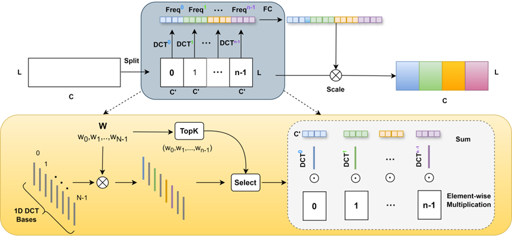

# AFCASelf-ONN: A Myocardial Infarction Detection Model with Self-Organized Operational Neural Networks and Adaptive Frequency-Channel Attention for Dual-Lead ECG Analysis

This repository includes a PyTorch implementation of 'AFCASelf-ONN: A Myocardial Infarction Detection Model with Self-Organized Operational Neural Networks and Adaptive Frequency-Channel Attention for Dual-Lead ECG Analysis' . Our code makes use of the Physikalisch-Technische Bundesanstalt (PTB) database, available [here](https://physionet.org/content/ptbdb/1.0.0/).

The architecture of the model is as follows:

The architecture of the AFCA is as follows:

### Requirements
* Python 2.7
* NumPy 1.16.1 (or later)
* PyTorch 0.4.1 (or later)
* Matplotlib
* wfdb

#### Train the network

You can run the main.py function to run the code directly and change some of the parameters and models.

